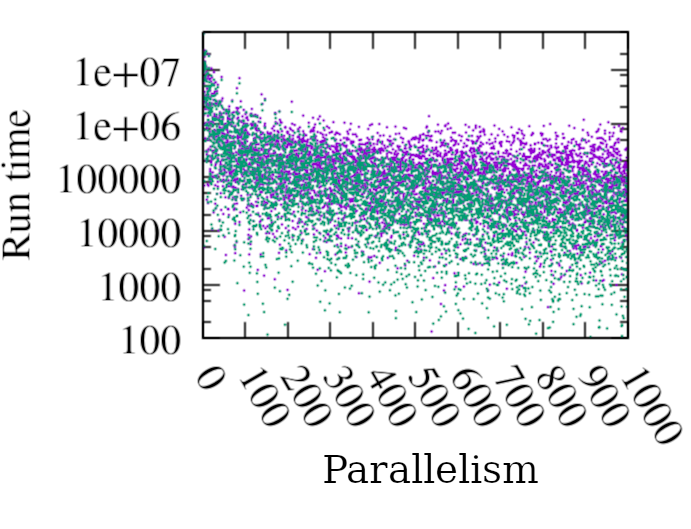
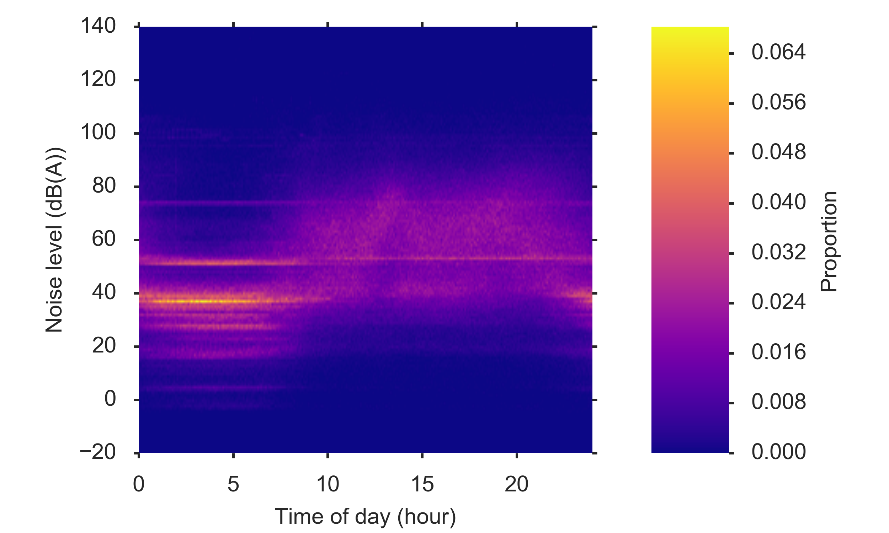
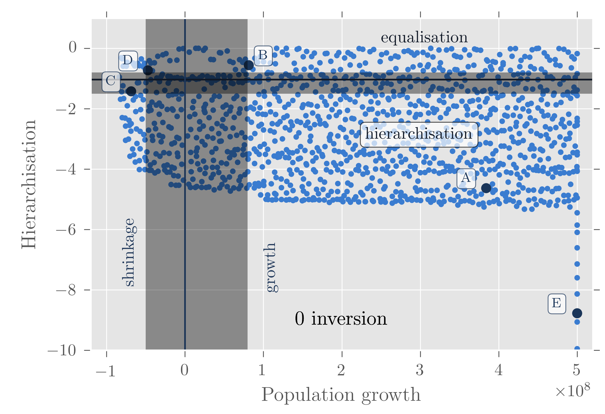
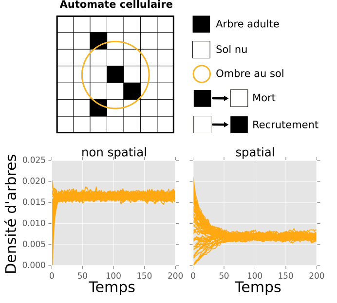

Présentation
============

Docteur en modélisation de systèmes complexes. Avec mon expérience depuis 2010
au CNRS, à l'Inria et à l'Université Paris 6, je vous aide à:

- exploiter vos **données** (écologiques, sonores, mobiles, spatiales,…),
- développer des **modèles** informatiques de systèmes complexes,
- réaliser des études en **simulation**,
- concevoir des algorithmes (génétiques, bayésiens, …) pour la simulation, la
  **calibration** de modèle, l'**estimation** d'information incomplète, la
  **prédiction** …
- automatiser des tâches complexes avec l'**intelligence artificielle**,
- **développer des logiciels** pour rendre les résultats exploitables par vos
  équipes ou votre public.

J'ai travaillé avec Python, R, SQL pour analyser des données, Scala, Haskell, C
pour le développement logiciel, Bash pour l'automatisation de tâches sous Unix,
et plus récemment Rust, pour la découverte. Je suis toujours intéressé pour
découvrir de nouveaux langages et technologies.

Portfolio
=========

Un algorithme hautement parallélisable d'inférence bayésienne en simulation.
----------------------------------------------------------------------------

*2017-2020, CNRS, Institut des Systèmes Complexes — Paris Île-de-France.*

Les méthodes d'inférence bayésienne par simulation (Approximate Bayesian
Computation) requièrent un très grand nombre d'exécution de modèles. Celles-ci
étant indépendantes, on peut les exécuter en parallèle pour tirer profit des
ressources de calcul distribuées. Cet algorithme permet d'exploiter
efficacement des milliers de cpu en parallèle.

La figure ci-contre montre que le temps d'exécution de l'algorithme (vert)
décroit plus vite que celui de son concurrent (violet) lorsque le nombre de cpu
disponible (K) augmente. Chaque point correspond à une execution d'un
algorithme avec un paramètrage fixé. Les paramètres sont échantillonnés
uniformément pour tester les deux algorithmes dans un large éventail de
conditions.

Estimation de la pollution sonore
---------------------------------

*2016-2017, Inria, équipe Clime.*

Le bruit a des conséquences problématiques sur le sommeil, le cœur, les
performances scholaires… [#]_. Les smart-phones sont équipés de microphones qui
permettent de mesurer le niveau de bruit dans l'environnement de leurs
utilisateurs. La figure ci-contre montre l'évolution des niveaux de bruits
relevés par des téléphones mobiles.

En utilisant ces données, nous avons utilisé l'assimilation de données pour
estimer l'exposition au bruit d'utilisateurs individuels, et comparé les
expositions moyennes de deux populations. Sans surprise, Paris est plus
bruyante que le reste de la France.

.. [#] https://www.euro.who.int/en/health-topics/environment-and-health/noise/data-and-statistics

Exploration des sorties d'un modèle de simulation
-------------------------------------------------

*2013-2015, CNRS, Institut des Systèmes Complexes — Paris Île-de-France.*

Pour tester la validité d'un modèle qui vise à expliquer un phénomène, nous
avons proposé de rechercher ses comportements inattendus : ceux-ci peuvent
constituer des contre-exemples, révéler des bugs ou des erreurs dans les
hypothèses sous-jacentes. À cette fin, notre algorithme génétique PSE (pour
pattern space exploration) explore les sorties possibles d'un modèle en
simulation. 

Nous l'avons appliqué à un modèle de croissance de villes [#]_. La
figure ci-contre montre que le modèle est capable de produire des systèmes de
villes dont la hiérarchisation (le rapport entre la taille de ville la plus
grande et celle des autres) et la croissance de la population dépassent
largement les valeurs plausibles pour un géographe (zones grises).

.. [#] https://journals.plos.org/plosone/article?id=10.1371/journal.pone.0138212

Un modèle spatial de la dynamique de population d'arbres en savanne
-------------------------------------------------------------------

*2010-2013, Université Paris 6, Laboratoire Bioemco.*

En savane, les bosquets réduisent localement l'intensité du feu en projetant de
l'ombre au sol qui diminue le combustible — l'herbe — qui pousse. Ces
regroupement d'arbres pourraient jouer un rôle sur la population globale en
protégeant les jeunes pousses du feu. Ce modèle confirme que l'organisation
spatiale joue un rôle sur la dynamique de population globale, mais dans l'autre
sens : la population d'arbres est moindre comparée à un modèle qui non spatial.

Cette figure représente le modèle et des résultats de simulation. Le modèle de
type automate cellulaire fait évoluer la présence d'arbres (cases noires) en
fonction des recrutements (passages des jeunes au stade adulte) et des morts.
Ces événements dépendent de la présence de voisins via l'ombre projetée dans le
cas spatial, et de la densité d'arbres globale dans le cas non spatial. Lorsque
l'espace n'est pas pris en compte, la population d'arbres atteint un niveau
plus élevé que lorsqu'il l'est.

